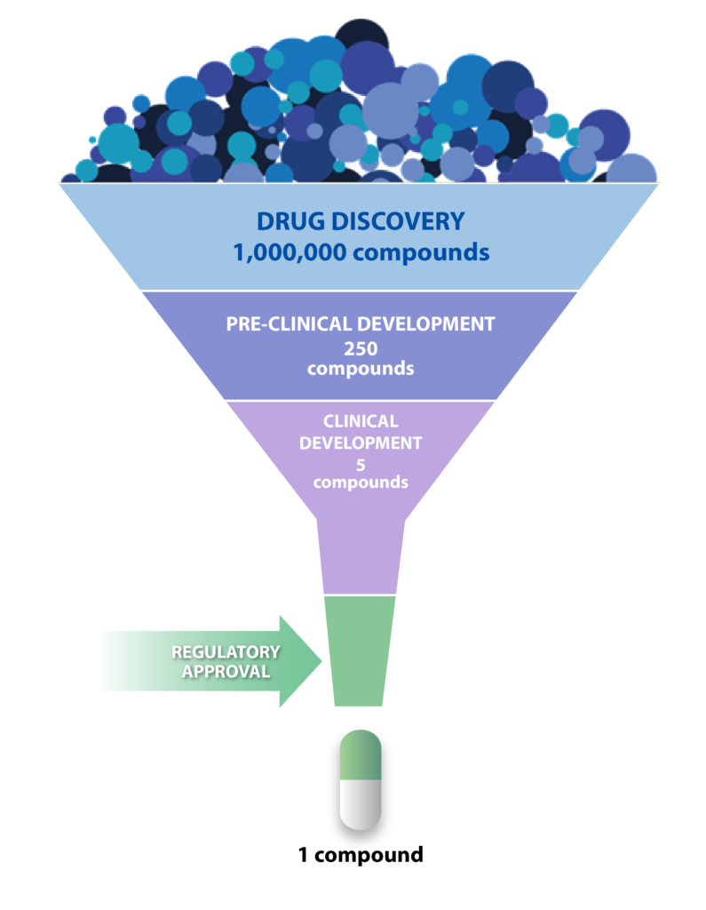
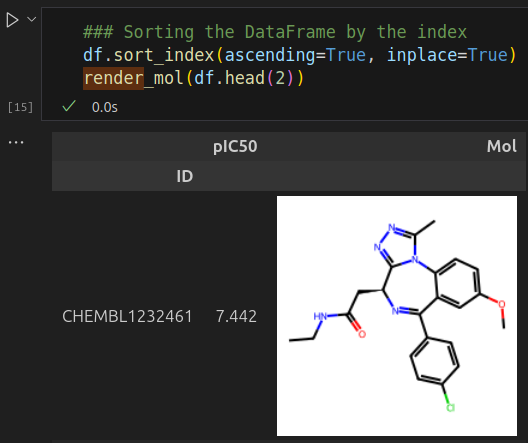
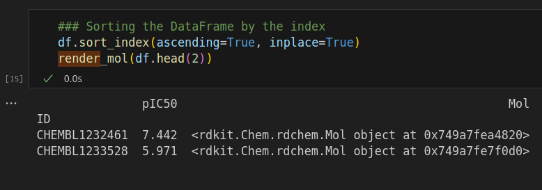

# Background
## Drug Discovery - Oncology
- Overall cost to bring a new anticancer drug to the market ranges from **$944 million** to **$4.54 billion** (2019 USD) - M. Schlander et *al.*: *PharmacoEconomics* 39, 1243–1269 (**2021**)
- Virtual screening can make the drug discovery funnel more efficient:

(Source: https://multispaninc.com/drug-discovery-services-and-high-throughput-screening)

## The Target - BRD4
Bromodomain-containing protein 4 (BRD4) is a significant target due to its role in regulating gene expression and its involvement in cancer and other diseases.

**1. Role and Function:**

BRD4 is a member of the bromodomain and extra-terminal (BET) family of proteins, which play a crucial role in regulating gene expression.
It specifically recognizes and binds acetylated lysines on histones, a process critical for the regulation of transcriptional machinery.
By interacting with acetylated histones, BRD4 can recruit other transcriptional coactivators and chromatin-modifying enzymes, thereby influencing gene expression patterns.

**2. Biological Significance:**

**Cancer:** BRD4 has been implicated in several cancers, including leukemia, lymphoma, and solid tumors. It contributes to the regulation of oncogenes such as MYC and is involved in the formation of super-enhancer regions, which drive the expression of oncogenes.
**Inflammatory Diseases:** Beyond cancer, BRD4 is also associated with inflammatory conditions and has been explored as a target for treating diseases like rheumatoid arthritis.

**3. Drug Discovery:**

**Inhibitors:** Targeting BRD4 with small molecules, known as BET inhibitors, has shown promise in preclinical studies and clinical trials. These inhibitors can disrupt BRD4's interaction with acetylated lysines, thereby modulating gene expression.
**Degradation:** BRD4 is a common target in the field of targeted-protein degradation (molecular glues and PROTACs). Which are outside the scope of this project. 

**References:**

- Filippakopoulos, P., et al. (2012) "Selective inhibition of BET bromodomains." Nature, 468(7327), 1067-1073. DOI: 10.1038/nature09504
- Zhang, J., et al. (2017) "Structural basis for the inhibition of the BET bromodomain by small molecules." Journal of Medicinal Chemistry, 60(12), 5600-5611. DOI: 10.1021/acs.jmedchem.6b01630
- Wu, L., et al. (2019) "Development of potent and selective inhibitors targeting the BRD4 bromodomain." Nature Communications, 10, 2511. DOI: 10.1038/s41467-019-10544-0

# Usage

## Functions
**render_mol()**

In this repository chemical structures are predominantly displayed as RDKit mol objects in pandas DataFrames. The function `rdkit.Chem.PandasTools.ChangeMoleculeRendering(df)` is renamed `render_mol()`. It renders the structures if the jupyter notebooks cell output setting are **text/html**:

Output settings as **text/plain** shows the mol objects id:

